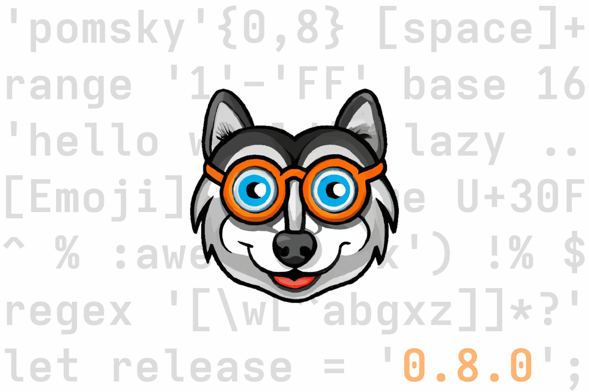

> The new logo: A pomeranian husky wearing orange glasses, created with the help of [DALL·E 2](https://openai.com/dall-e-2/)

## What is pomsky?

Pomsky is a portable, modern syntax for regular expressions. It has powerful features, such as
variables, and a much more readable syntax. Check out the
[language tour](https://pomsky-lang.org/docs/language-tour/basics/) to quickly get familiar with
pomsky, or the [examples](https://pomsky-lang.org/docs/examples/) to see some real pomsky
expressions.

Pomsky is _not_ a regex engine. Instead, a pomsky expression is transpiled to a normal RegExp,
compatible with many RegExp engines, including JavaScript, Java, PCRE, Ruby, Python, Rust and .NET.

## Announcement

Hi! I'm Ludwig, and I created Pomsky in my spare time. I am pleased to announce that you can now [sponsor me](https://github.com/sponsors/Aloso) for my work! It's been a lot of fun to develop Pomsky, but as Pomsky is being used by more and more people, I will need more time for maintenance and improving the developer experience.Donations will help me to invest the time needed. If you can spare a few bucks or convince your employer to sponsor me, that would go a long way to make Pomsky sustainable.

All sponsors will receive monthly updates on what I am working on, as I want to be transparent about how your money is used. Find out more on [my GitHub sponsors page](https://github.com/sponsors/Aloso).

## Summary of the changes

This release focuses on stability, but also brings a few new features:

> - Inline regexes landed, allowing you to use regex features not yet supported by Pomsky
>
> - Pomsky now supports the dot, matching any code point
>
> - An optimization pass that tries to make the generated regex smaller
>
> - Many bugs were fixed

## Inline regexes

Inline regexes are an escape hatch to include an arbitrary regex, at the cost of fewer compile-time guarantees. They are added to the output without any escaping; you could compare this to inline assembly in higher-level languages like C or Rust. Inline regexes allow you to produce hand-optimized code, or use regex features that aren't properly supported yet. For example:

```pomsky
let recurse = regex '(?R)';  # inline regex for using recursion

let number = '-'? [digit]+;
let operator = '+' | '-' | '*' | '/';
let expr = number | '(' recurse ')';

expr (operator expr)*  # matches an arbitrarily nested term
```

Note that recursion using the `(?R)` syntax only works in the [PCRE flavor](https://pomsky-lang.org/docs/reference/comparison/#explanation-of-the-flavors).

Inline regexes are very powerful, but use them sparingly: Pomsky doesn't parse their content, so it cannot warn you from mistakes. Pomsky usually guarantees that the regexes it generates are valid, but this guarantee may not hold if you're using inline regexes.

## The dot

You're probably wondering: [The dot](https://www.regular-expressions.info/dot.html) is one of the most important regex features, so why was it missing until now? I have been hesitant to add it because it's so easy to forget that the dot does not match line breaks by default. Also, the dot is not Unicode-aware in all regex variants, and all regex engines treat line breaks slightly differently. That's why I initially didn't include the dot, and recommended to use `Codepoint` (abbreviated as `C`) instead.

However, `Codepoint` won't work in ERE (POSIX-extended regular expressions), which we want to support eventually. Also, I decided that best practices such as avoiding the dot are best enforced by a linter rather than the compiler, so specific lints can be disabled when necessary. Pomsky doesn't have a linter _yet_, but it's still on my todo list.

## Optimizations

Pomsky now does an optimization pass right before code generation. Before, optimizations were intermingled with parsing and code generation, which led to some problems: Parsing wasn't lossless (extra parentheses would get lost), and the code was hard to maintain and iterate on. The new optimization pass solves these problems while significantly improving the generated code in some cases:

- Subsequent repetitions are now merged whenever possible. For example, `('x'{1,9})?` becomes `x{0,9}`.
- Duplicated items in a character set are removed. For example, `['hello world']` becomes `[helo wrd]`.
- Empty groups like `(() '')` are removed, even when followed by a repetition.

More optimizations are planned: For example, we want to make it possible to combine alternatives with a common prefix, like `'make' | 'maple' | 'maker'`. Ideally, this would produce the output `ma(ker?|ple)`, which is much faster in more traditional regex engines that use backtracking instead of a [DFA](https://en.wikipedia.org/wiki/Deterministic_finite_automaton).

## Testing improvements and bugfixes

For this release we improved our testing and fuzzing infrastructure. We have a test harness with several hundred hand-written test cases. For each test case, we check if compiling it produces the expected output, or fails with the expected error if the input is malformed. We also have a fuzzer, which generates test cases and systematically mutates them to discover new code paths. While the test harness verifies that the output is correct, the fuzzer can only verify that the program doesn't crash, since we can't manually check millions of generated test cases.

So to increase our confidence in Pomsky's correctness, we started to compile regexes produced by Pomksy with the respective regex engine. For now, we only do this in the Rust and PCRE flavors, but we plan to compile more regex flavors in the future. This still doesn't guarantee that the output is correct, but at least it checks if the output is syntactically valid. With this change, the fuzzer was able to find a few bugs during code generation.

We also started measuring test coverage and uploading it to [coveralls.io](https://coveralls.io/github/rulex-rs/pomsky?branch=main). Looking at the reports helped us identify parts that needed more tests, and improving our test coverage. Unfortunately, the data isn't as reliable as we'd hoped: Coveralls highlights many struct definitions and enum variants as "untested", which is inaccurate. Measuring test coverage is still a net win, just don't read too much into the numbers 😉

## Auditable binaries

The binaries [published on GitHub](https://github.com/rulex-rs/pomsky/releases) and the [AUR](https://aur.archlinux.org/packages/pomsky-bin) are now built with `cargo audit`, so we can be sure there are no known vulnerabilites when we publish a new version. Additionally, the list of dependencies is embedded in the binaries, so you can check with `cargo audit bin <PATH_TO_BINARY>` if any vulnerabilities were found since then. [cargo-audit](https://github.com/rustsec/rustsec) is a tool that scans libraries for advisories reported in the [rustsec advisory DB](https://rustsec.org/).

## CLI changes

You can now disable all warnings with `-W0`, compatibility warnings with `-Wcompat=0`, and deprecation warnings with `-Wdeprecated=0`. Needless to say that doing this is discouraged, except in edge cases. Warnings exist for a reason!

You can specify which features should be allowed with `--allowed-features`. For example, with `--allowed-features boundaries,dot,lazy-mode,named-groups,ranges,references,variables`, only the specified language features are available. Without this argument, all features can be used.

The help messages have been extended. `pomsky -h` now gives a short summary, while `pomsky --help` provides more detailed information.

You might remember that I replaced `clap` with a more lightweight argument parsing library. The new library we're using doesn't support help generation, so I wrote a macro to generate help messages that can contain formatting and color. It is general enough that I might publish it as a separate crate, stay tuned!

---

Happy Hanukkah! Merry Christmas! Happy Holidays!

Ludwig
